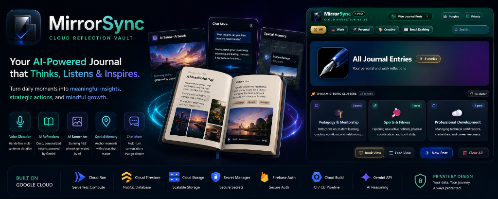
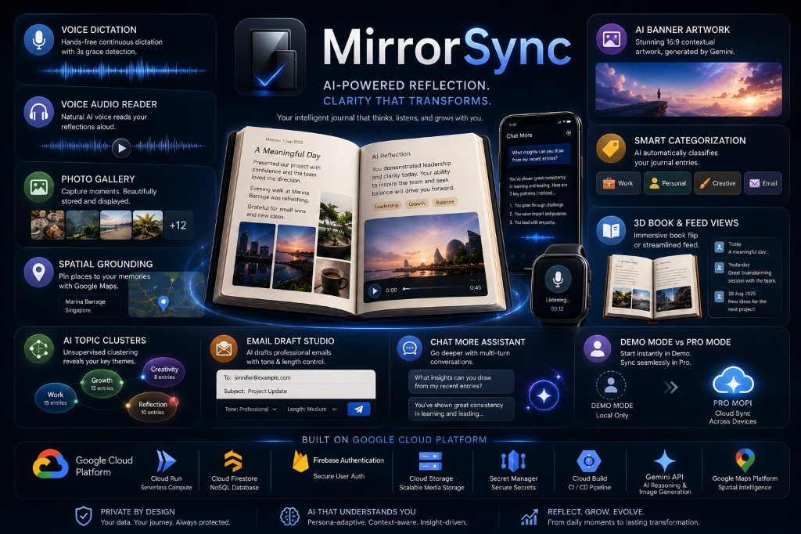

# MirrorSync

> **Persona-Adaptive Cognitive Journal & Executive Reflection Intelligence Engine**  
> *Built for the **Google Cloud Gen AI Academy Cohort 3 Ideathon Challenge**.*  
> *Prototyped in **Google AI Studio**, architected & hardened with **Google Antigravity**, and deployed on **Google Cloud Run** via **Google Cloud Build**.*

[](https://mirrorsync-217104786977.us-central1.run.app)
[](https://ai.google.dev/)
[](https://firebase.google.com/)
[](https://developers.google.com/maps)
[](LICENSE)

<p align="center">
  
</p>

<p align="center">
  <strong>▶ Watch the MirrorSync Project Walkthrough</strong><br>
  <sub>See the deployed application in action.</sub>
</p>

<p align="center">
  <a href="https://www.youtube.com/watch?v=jzinWA-A2jA" target="_blank"><strong>Watch on YouTube →</strong></a>
</p>

<p align="center">
  <a href="https://www.youtube.com/watch?v=jzinWA-A2jA" target="_blank">
    
  </a>
</p>

---

## 🌟 Executive Overview & The Story Behind MirrorSync

Most journaling applications operate as passive digital notebooks: you dump raw thoughts, and at best, receive generic, one-size-fits-all summaries. Real human growth and mental clarity, however, occur through **structured cognitive synthesis, deep pedagogical/strategic calibration, emotional grounding, and continuous multi-turn dialogue**.

**MirrorSync** is an intelligent, privacy-first reflection engine designed to turn fragmented daily thoughts into high-leverage clarity, executive actions, and mindful growth. It dynamically calibrates its reasoning lens based on your unique persona.

---

## 🏆 Ideathon Evaluation Pillars & Architecture Matrix

MirrorSync was specifically designed and engineered against the four official evaluation criteria of the **Gen AI Academy Cohort 3 Ideathon Challenge**:

```
┌──────────────────────────────────────────────────────────────────────────────────────────────────┐
│                                  MIRRORSYNC EVALUATION MATRIX                                    │
├───────────────────────┬────────────────────────┬────────────────────────┬────────────────────────┤
│     AUTHENTICITY      │       USABILITY        │       STABILITY        │        SECURITY        │
├───────────────────────┼────────────────────────┼────────────────────────┼────────────────────────┤
│ • Solves real human   │ • Continuous voice     │ • Multi-tier Gemini    │ • Strict Firestore UID │
│   cognitive fatigue   │   dictation & speech   │   model ladder         │   path isolation rules │
│ • Persona extraction  │ • Word teleprompter &  │ • Graceful 429 quota   │ • Cloud Storage user   │
│   & tone calibration  │   audio player         │   spike mitigation     │   sandbox & MIME rules │
│ • Unsupervised dynamic│ • Photo gallery with   │ • Zero-downtime Cloud  │ • Secret Manager key   │
│   topic clustering    │   Cloud Storage sync   │   Run auto-scaling     │   isolation (IAM)      │
│ • Domain-tailored     │ • Auto 16:9 banner art │ • Multi-device state   │ • Built-in 5-zone      │
│   reasoning engines   │ • 3D Book & Feed views │   & media sync         │   OWASP LLM inspector  │
└───────────────────────┴────────────────────────┴────────────────────────┴────────────────────────┘
```

---

## 🛠️ Google Cloud Platform (GCP) Architecture & Infrastructure

MirrorSync is built from the ground up on Google Cloud Platform, uniting serverless compute, multimodal AI reasoning, secure NoSQL data partitioning, user-isolated media storage, and geospatial intelligence:

```
┌────────────────────────────────────────────────────────────────────────────────────────────────────────┐
│                                       MIRRORSYNC GCP ARCHITECTURE                                      │
└────────────────────────────────────────────────────────────────────────────────────────────────────────┘

 [ Client Presentation Layer ]
   • React 19 + TypeScript + Vite SPA + Tailwind CSS (3D Book Journal & Responsive Feed)
   • Web Speech API (Continuous Voice Dictation with 3s Grace + Natural Neural Voice Synthesis)
   • Google Maps Platform (@vis.gl/react-google-maps for Dark-Mode Spatial Grounding)
   • Client-Side HTML Canvas Compressor (Automatic 1600px WebP/JPEG Optimization)
          │
          │ HTTPS / REST / SSE
          ▼
 [ Compute & API Gateway Layer: Google Cloud Run ]
   • Serverless Node.js + Express Container with Zero Cold-Start Auto-Scaling (0 to N)
   • Continuous Deployment (CD) via Google Cloud Build on every push to main
   • 1MB JSON Body Armor, Strict CORS Policy & System Prompt Injection Fencing
          │
          ├──────────────────────────┬──────────────────────────┬──────────────────────────┐
          ▼                          ▼                          ▼                          ▼
 [ Google Secret Manager ]  [ Cloud Firestore ]       [ Firebase Cloud Storage ] [ Google Gemini API ]
  • GEMINI_API_KEY Vault     • Multi-Tenant NoSQL      • User-Isolated Buckets    • gemini-3.8-flash (Primary)
  • IAM Least-Privilege      • Strict Path Partition:  • /users/{uid}/entries/    • Multi-Tier Fallback Ladder
    Service Account Access     /users/{uid}/entries/**   {id}/photos/ & /banner/  • gemini-3.1-flash-lite-image
                             • Server-Authoritative    • Cascade Delete Purge       (16:9 Contextual Art)
                               Security Rules            on Entry Deletion        • Prototyped in AI Studio
```

### Core GCP & Google Technologies Utilized:

| Service / Technology | Role & Engineering Implementation in MirrorSync |
| :--- | :--- |
| **Google Cloud Run** | Fully managed serverless container runtime hosting the Node.js Express backend and compiled Vite SPA with auto-scaling (`0` to `N`), HTTP/2, and zero-downtime deployments. |
| **Google Cloud Build** | Native CI/CD pipeline triggered automatically on every push to `main` with buildpack containerization and rolling Cloud Run release steps. |
| **Google AI Studio** | Used to design, prototype, few-shot calibrate, and export structured JSON schemas and system prompts for persona-adaptive reflection. |
| **Google Gemini API (`@google/genai`)** | Multi-tier reasoning hierarchy:<br>• **`gemini-3.8-flash`**: Primary multimodal cognitive reflection, domain classification, and structured takeaways.<br>• **`gemini-3.7-flash` / `gemini-3.5-flash` / `gemini-3.5-flash-lite` / `gemini-2.5-flash` / `gemini-2.5-flash-lite`**: Automated fallback tiers.<br>• **`gemini-3.1-flash-lite-image`**: Native Gemini image generation for 16:9 banner illustrations. |
| **Google Secret Manager** | Secure storage for `GEMINI_API_KEY`, accessed strictly at runtime via IAM service account bindings (`roles/secretmanager.secretAccessor`). |
| **Cloud Firestore** | Multi-tenant database enforcing strict subcollection path isolation (`/users/{userId}/**`) locked by server-authoritative Firestore Security Rules. |
| **Firebase Cloud Storage** | User-isolated media storage for journal photos and generated 16:9 banner illustrations (`/users/{userId}/entries/{entryId}/**`) with client-side canvas compression and automated cascade cleanup on post deletion. |
| **Firebase Authentication** | Google Single Sign-On (SSO) with popup auth and JWT session verification to separate instant local Demo Mode from cloud-synced Pro Mode. |
| **Google Maps Platform (`@vis.gl/react-google-maps`)** | Spatial memory grounding, place search, coordinate pinning, and interactive dark-mode map snippet previews. |
| **Google Speech Services & Web Audio** | Continuous speech recognition engine for hands-free dictation with 3s grace silence detection, paired with Google neural text-to-speech for "Read Aloud" narration with word seeking. |

---

## 🚀 Key Features & Capabilities

<p align="center">
  
</p>

```
┌────────────────────────────────────────────────────────────────────────────────────────┐
│                                   FEATURE SHOWCASE                                     │
├────────────────────────────────────────────────────────────────────────────────────────┤
│ 1. 🎙️ Continuous Multi-Sentence Voice Dictation with 3s Grace Detection               │
│ 2. 🎧 Natural Voice Audio Reader (Read Aloud) with Word Teleprompter & Speed Control   │
│ 3. 📸 Instagram-Style Journal Photo Gallery with Cloud Storage & Lightbox Modal        │
│ 4. 🗺️ Google Maps Spatial Grounding & Place Memory Anchoring                          │
│ 5. 🎨 Automated 16:9 Contextual Banner Artwork Generation via Gemini                   │
│ 6. 🏷️ Smart Automatic Content Categorization (Work, Personal, Creative, Email)         │
│ 7. 📖 Immersive 3D Leather Book Flip Journal vs. Streamlined Feed View                 │
│ 8. 🔮 Dynamic Unsupervised AI Topic Clustering Cards                                   │
│ 9. ✉️ Executive Email Drafting Studio with Length & Tone Controls                     │
│ 10. 💬 Prominent "Chat More" Multi-Turn Assistant with Animated Silver-Blue Shimmer    │
│ 11. 👤 Demo Mode vs. Pro Mode (Google Firebase SSO + Firestore + Storage Sync)         │
└────────────────────────────────────────────────────────────────────────────────────────┘
```

### 1. 🎙️ Continuous Multi-Sentence Voice Dictation with 3s Grace Detection ([ReflectionInput.tsx](src/components/ReflectionInput.tsx))
- **Hands-Free Journaling**: Real-time Web Speech dictation with continuous multi-sentence capture (`continuous: true`, `interimResults: true`).
- **Live Sound Waves & Audio Detection**: Pulsating green equalizer indicators reflect active voice detection in real time.
- **3-Second Grace Silence Detection**: When speech pauses, an intelligent 3-second countdown timer initiates (`⏳ Silence detected — stopping in 3s...`). If you resume speaking, the timer cancels and listening continues seamlessly without cutting you off.

### 2. 🎧 Natural Voice Audio Reader (Read Aloud) ([JournalVoicePlayer.tsx](src/components/JournalVoicePlayer.tsx))
- **High-Performance Audio Player**: Listen to your journal memo and AI reflection read aloud with clear, natural speech synthesis.
- **Interactive Teleprompter & Word Seeking**: Click anywhere on the progress bar to scrub and jump to specific timestamps or words.
- **Instant Speed Switching**: Toggle playback speed between `0.8x`, `1.0x`, `1.2x`, and `1.5x` with real-time character-position preservation.
- **Simple Controls**: One-touch **Play**, **Pause**, and **Resume** buttons.

### 3. 📸 Instagram-Style Journal Photo Gallery & Cloud Storage ([JournalPhotoGallery.tsx](src/components/JournalPhotoGallery.tsx))
- **Parked Directly Under Post Memo**: Positioned cleanly below the journal paper memo sheet in both condensed and expanded views.
- **Adaptive Multi-Photo Formats**:
  - *1 Photo*: Full-width high-resolution hero display with zoom on hover.
  - *2 Photos*: Clean symmetrical 2-column split.
  - *3 Photos*: 1 large featured left tile + 2 stacked right tiles.
  - *4+ Photos*: 2x2 quad grid with a frosted `+N more` overlay opening the full gallery.
- **Full-Screen Lightbox Modal**: Click any photo to view high-resolution imagery, navigate with keyboard arrow keys or thumbnail seeking, download, and delete.
- **Automated Cloud Storage Lifecycle**:
  - Uploads directly to user-isolated Cloud Storage paths (`/users/{uid}/entries/{entryId}/photos/`).
  - Automatic client-side canvas compression for snappy uploads and bandwidth savings.
  - Individual photo deletions instantly purge the asset from Cloud Storage.
  - Deleting an entry automatically cascades and cleans up all associated photos and AI banners.

### 4. 🗺️ Google Maps Spatial Grounding ([GoogleMapView.tsx](src/components/GoogleMapView.tsx))
- **Memory Anchoring**: Tag any reflection with real-world places (e.g., *Google Campus, Mountain View*, *Kallang Tennis Centre, Singapore*).
- **Interactive Map Previews**: Features an embedded double-height Google Map preview with custom dark-mode styling, coordinate pins, and full-screen view modal.

### 5. 🎨 Automated AI Post Banner Generation ([EditorialArtCanvas.tsx](src/components/EditorialArtCanvas.tsx))
- **Contextual Visual Synthesis**: Uses Google's `gemini-3.1-flash-lite-image` engine to generate high-resolution 16:9 banner illustrations tailored to the mood, location, and topic of your entry.
- **Cloud Storage Persistence**: Automatically uploads generated banners to Cloud Storage (`/users/{uid}/entries/{entryId}/banner/`) and deletes outdated banner versions when regenerated.
- **Standby & Prompt Editor**: Includes elegant category standby artwork and an interactive prompt editor allowing users to tweak visual instructions and regenerate artwork on demand.

### 6. 🏷️ Smart Automatic Content Categorization ([server.ts](server.ts))
- **Multi-Domain Intelligence**: Automatically classifies raw thoughts into **Work**, **Personal**, **Creative**, or **Email Drafting**.
- **Domain-Specific Cognitive Engines**:
  - **Work**: Extracts action items checklists, operational next steps, and project blockers.
  - **Personal**: Highlights well-being observations, mindfulness insights, and emotional sentiment.
  - **Creative**: Generates innovative creative spark challenges and exploratory exercises.
  - **Email Drafting**: Constructs send-ready email drafts with recipient and tone controls.

### 7. 📖 Dual-View Mode: 3D Leather Book vs. Feed View ([BookJournalView.tsx](src/components/BookJournalView.tsx))
- **Luxury Book Flip Experience**: Features rich vintage saddle brown leather grain, embossed spine ribs, 3D satin bookmark ribbons, realistic lined journal paper with subtle dotted grids, and smooth left/right drag page advance gestures.
- **Protected Text Selection**: Standard text selection (`cursor-text`) is preserved over the journal paper so you can copy and highlight words freely without shifting pages.
- **Streamlined Vertical Feed**: One-click toggle to switch to a rapid vertical feed view with expandable cards.

### 8. 🔮 Dynamic Unsupervised AI Topic Clustering Cards ([DynamicCategoryCards.tsx](src/components/DynamicCategoryCards.tsx))
- Automatically clusters journal history into emergent topical archetypes with keyword tags and entry count analytics.

### 9. ✉️ Executive Email Drafting Studio ([EmailDraftingStudio.tsx](src/components/EmailDraftingStudio.tsx))
- Transforms unstructured draft thoughts or meeting notes into structured, professional emails with length controls (*Standard*, *Expanded*, *Concise*) and 1-click clipboard copying.

### 10. 💬 Prominent "Chat More" Multi-Turn Assistant ([ReflectionCard.tsx](src/components/ReflectionCard.tsx))
- Features an animated silver-to-celestial-blue shimmer gradient title with multi-turn chat capabilities that extend dynamically downwards as conversation progresses.

### 11. 👤 Demo Mode vs. Pro Mode (Google SSO + Cloud Firestore Sync) ([App.tsx](src/App.tsx))
- **Demo Mode (Guest)**:
  - Instant access with zero sign-up friction.
  - Explore pre-seeded reflections across domains, test voice dictation, test Google Maps, upload local photos, and generate live AI coaching.
  - Safe client-side persistence in local browser storage.
- **Pro Mode (Google Firebase SSO)**:
  - One-click Google Single Sign-On via Firebase Authentication.
  - Real-time cloud sync to **Cloud Firestore** and **Firebase Cloud Storage** under strict subcollection isolation (`/users/{uid}/entries/**`).
  - Seamless multi-device access with automatic migration of local guest entries upon first login.

---

## ⚡ Automated Gemini Fallback Ladder

To ensure MirrorSync never goes down during high-traffic spikes or quota limits, API calls run through an automated fallback hierarchy:

```
[ Primary: gemini-3.8-flash ]
           │ (On 429 Quota / 503 Busy / Timeout)
           ▼
[ Tier 2: gemini-3.7-flash ]
           │ (On Rate Limit)
           ▼
[ Tier 3: gemini-3.5-flash ]
           │ (On Rate Limit)
           ▼
[ Tier 4: gemini-3.5-flash-lite ]
           │ (On Rate Limit)
           ▼
[ Tier 5: gemini-2.5-flash / gemini-2.5-flash-lite ]
           │ (Emergency Continuity)
           ▼
[ Graceful Deterministic Local Semantic Engine ]
```

---

## 🔒 Database & Storage Security Rules

### Firestore Security Rules (`firestore.rules`)

```javascript
rules_version = '2';
service cloud.firestore {
  match /databases/{database}/documents {
    
    // Core Authentication & Ownership Helpers
    function isAuthenticated() {
      return request.auth != null;
    }

    function isOwner(userId) {
      return isAuthenticated() && request.auth.uid == userId;
    }

    // Payload validation helper
    function isValidEntry() {
      // Ensure incoming entries do not exceed safe payload boundaries
      return request.resource.data.rawText is string
        && request.resource.data.rawText.size() <= 100000;
    }

    // 1. Authenticated User Profile Document (/users/{userId})
    match /users/{userId} {
      allow get, list, write: if isOwner(userId);

      // 2. Isolated Journal Entries Subcollection (/users/{userId}/entries/{entryId})
      match /entries/{entryId} {
        allow get, list, delete: if isOwner(userId);
        allow create, update: if isOwner(userId) && isValidEntry();
      }

      // 3. Fallback for any other user-owned nested subcollections
      match /{document=**} {
        allow read, write: if isOwner(userId);
      }
    }

    // 4. Default Deny-All for any root or unmapped collections
    match /{document=**} {
      allow read, write: if false;
    }
  }
}
```

### Firebase Cloud Storage Security Rules (`storage.rules`)

User photos and generated banner illustrations are strictly isolated under `/users/{userId}/**` with content type verification and file size limits:

```javascript
rules_version = '2';
service firebase.storage {
  match /b/{bucket}/o {
    
    function isAuthenticated() {
      return request.auth != null;
    }

    function isOwner(userId) {
      return isAuthenticated() && request.auth.uid == userId;
    }

    function isValidImage(maxMb) {
      return request.resource.contentType.matches('image/.*')
        && request.resource.size < maxMb * 1024 * 1024;
    }

    match /users/{userId} {
      match /entries/{entryId}/{allPaths=**} {
        allow read: if isOwner(userId);
        allow write: if isOwner(userId) && isValidImage(15);
        allow delete: if isOwner(userId);
      }

      match /{allPaths=**} {
        allow read: if isOwner(userId);
        allow write: if isOwner(userId) && isValidImage(15);
        allow delete: if isOwner(userId);
      }
    }

    match /{allPaths=**} {
      allow read, write: if false;
    }
  }
}
```

---

## 🚀 Continuous Deployment & Google Cloud Run Setup

### 1. Enable Required Google Cloud APIs

```bash
# Set your project ID
export PROJECT_ID=genaiacademy3
export REGION=us-central1
export SERVICE_NAME=mirrorsync

gcloud config set project $PROJECT_ID

# Enable Cloud Run, Secret Manager, Cloud Build, Artifact Registry, and Firestore
gcloud services enable \
  run.googleapis.com \
  secretmanager.googleapis.com \
  cloudbuild.googleapis.com \
  artifactregistry.googleapis.com \
  firestore.googleapis.com
```

### 2. Provision GEMINI_API_KEY in Secret Manager

```bash
# Create secret in Secret Manager
echo -n "YOUR_GEMINI_API_KEY_HERE" | gcloud secrets create GEMINI_API_KEY \
  --data-file=- \
  --replication-policy=automatic

# Grant Cloud Run default compute service account access to Secret Manager
export PROJECT_NUMBER=$(gcloud projects describe $PROJECT_ID --format='value(projectNumber)')
gcloud secrets add-iam-policy-binding GEMINI_API_KEY \
  --member=serviceAccount:${PROJECT_NUMBER}-compute@developer.gserviceaccount.com \
  --role=roles/secretmanager.secretAccessor
```

### 3. Configure Firebase Cloud Storage CORS

To permit photo uploads and banner updates directly from your Cloud Run web origin:

```bash
# Apply cors.json to your Cloud Storage bucket
gsutil cors set cors.json gs://mirrorsync-journal.firebasestorage.app
# OR using modern gcloud storage:
# gcloud storage buckets update gs://mirrorsync-journal.firebasestorage.app --cors-file=cors.json
```

### 4. Continuous Deployment (CD) via Cloud Build Triggers

1. Connect your GitHub repository (`MirrorSyncJournal`) under **Cloud Build** ➔ **Repositories (1st gen)**.
2. Create a Cloud Build Trigger:
   - **Event**: Push to a branch (`^main$`)
   - **Configuration**: Inline Cloud Build configuration:

```yaml
steps:
  - name: 'gcr.io/google.com/cloudsdktool/cloud-sdk'
    entrypoint: gcloud
    args:
      - 'run'
      - 'deploy'
      - 'mirrorsync'
      - '--source=.'
      - '--project=genaiacademy3'
      - '--region=us-central1'
      - '--platform=managed'
      - '--allow-unauthenticated'
      - '--set-secrets=GEMINI_API_KEY=GEMINI_API_KEY:latest'
      - '--set-env-vars=NODE_ENV=production'
      - '--update-labels=dev-tutorial=cloud-run-ai-challenge'

options:
  logging: CLOUD_LOGGING_ONLY
```

---

## 💻 Local Development Setup

```bash
# 1. Clone the repository
git clone https://github.com/bluechristopher/MirrorSyncJournal.git
cd MirrorSyncJournal

# 2. Install dependencies
npm install

# 3. Create .env.local file with your Gemini API key & Firebase credentials
cp .env.example .env.local

# 4. Start full-stack development server (Backend + Vite Frontend)
npm run dev

# 5. Build production bundle
npm run build
```

---

## 📂 Project Structure

```
├── Dockerfile                # Production container specification for Cloud Run
├── firestore.rules           # Hardened Firestore security and isolation rules
├── storage.rules             # Hardened Cloud Storage security and quota rules
├── metadata.json             # Applet capabilities and permissions
├── package.json              # App scripts and dependencies
├── server.ts                 # Full-stack Express backend with multi-tier Gemini model ladder
├── src/
│   ├── components/           # UI Components (JournalPhotoGallery, BookJournalView, Maps, Voice, Email)
│   ├── firebase.ts           # Firebase Auth, Firestore & Cloud Storage client SDK
│   ├── services/             # API client services & endpoints
│   ├── utils/                # Date formatting, semantic clustering utilities
│   ├── types.ts              # Global TypeScript interfaces and domain schemas
│   ├── App.tsx               # Primary application container
│   ├── main.tsx              # React DOM entrypoint
│   └── index.css             # Tailwind CSS & custom 3D luxury styling
```

---

## 📄 License & Compliance

Built for the **Google Cloud Gen AI Academy Cohort 3 Ideathon Challenge**. Open source under the [Apache 2.0 License](LICENSE).

